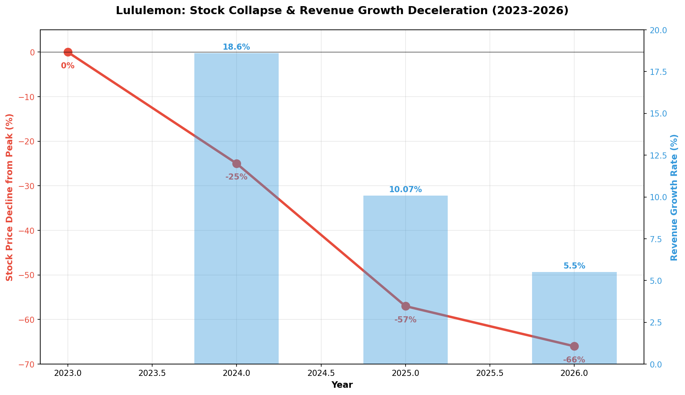
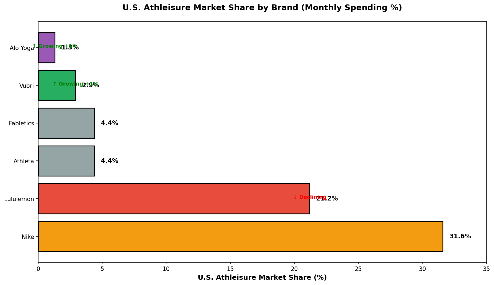
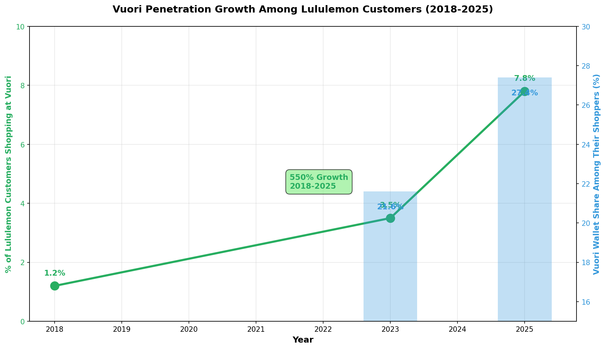
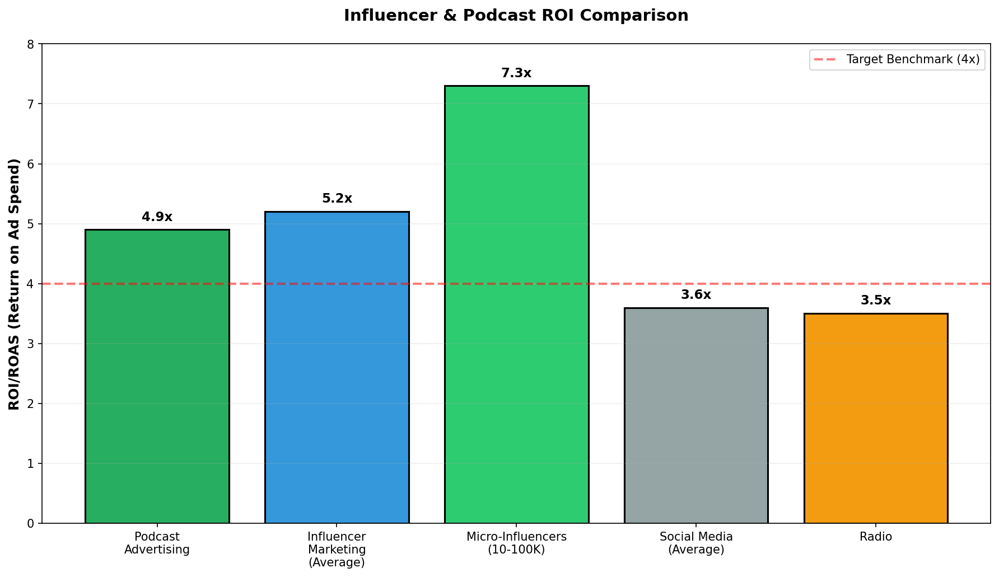
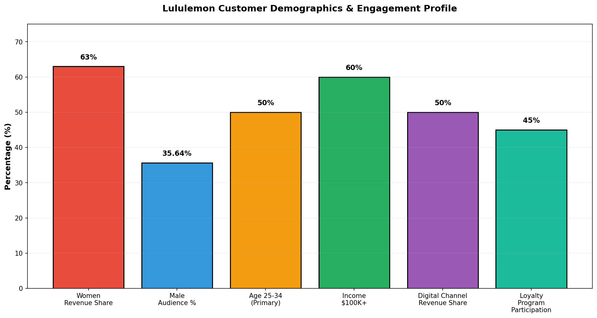

## All Charts (5 Total)

### Chart 1: Stock & Revenue Decline Timeline

**Type:** Dual-axis line and bar chart
**Data Points:**
- Stock decline: 0% (2023) → -25% (2024) → -57% (2025) → -66% (2026)
- Revenue growth rate: 18.6% (2024) → 10.07% (2025) → 5.5% (2026 projected)

**Key Finding:** Stock collapse (-66%) while revenue growth decelerates dramatically (18.6% → 5.5%)
**Insight:** Market has lost confidence in growth trajectory despite positive absolute revenue

---

### Chart 2: Market Share Comparison

**Type:** Horizontal bar chart (ranking)
**Brands Ranked:**
1. Nike: 31.6% (leader, declining)
2. Lululemon: 21.2% (declining)
3. Athleta: 4.4% (stable)
4. Fabletics: 4.4% (stable)
5. Vuori: 2.9% (growing +1% annually)
6. Alo Yoga: 1.3% (growing +1% annually)

**Key Finding:** Lululemon #2 market share masks reality that smaller competitors growing faster
**Insight:** Market share concentration advantage eroding to faster-growing, lower-priced competitors

---

### Chart 3: Vuori Penetration Growth

**Type:** Dual-axis line and bar chart
**Penetration Data:**
- 2018: 1.2% of Lululemon customers shop at Vuori
- 2023: ~3.5% (estimated)
- 2025: 7.8% of Lululemon customers shop at Vuori
- Growth rate: 550% increase over 7 years

**Wallet Share Data:**
- 2023: 21.6% of Vuori shoppers' athleisure spending
- 2025: 27.4% of Vuori shoppers' athleisure spending
- Growth: +5.8 percentage points YoY

**Key Finding:** Vuori represents existential competitive threat with accelerating market penetration
**Insight:** Most customers aren't abandoning Lululemon; they're adding Vuori to their purchasing mix

---

### Chart 4: Influencer vs Podcast ROI Comparison

**Type:** Bar chart with benchmark line
**ROI/ROAS by Channel:**
- Micro-Influencers (10-100K): 7.3x (highest)
- Influencer Marketing (average): 5.2x
- Podcast Advertising: 4.9x
- Social Media (average): 3.6x
- Radio: 3.5x

**Benchmark:** 4x minimum target (red dashed line)

**Key Finding:** Micro-influencers deliver highest ROI; podcasts outperform social media by 36%
**Insight:** Integrated micro-influencer + podcast strategy optimizes marketing efficiency above benchmark

---

### Chart 5: Customer Demographics Breakdown

**Type:** Bar chart (demographic metrics)
**Customer Profile:**
- Women revenue share: 63%
- Male audience (website): 35.64%
- Age 25-34 (primary): 50% of customer base
- Income $100K+ threshold: 60%
- Digital channel revenue: 50%
- Loyalty program participation: 45%

**Key Finding:** Affluent, female, educated, digitally-engaged customer base with untapped loyalty potential
**Insight:** Only 45% loyalty participation = opportunity to deepen program engagement and retention

---

## Source Research Documents

1. [Customer Loyalty Research](lululemon_customer_loyalty_research) — demographics, loyalty, retention data
2. [Competitive Landscape](lululemon_competitive_landscape) — market share, competitor analysis, pricing
3. [Struggles 2024-2026](lululemon_struggles_2024_2026) — financial decline, operational issues
4. [Influencer & Podcast Marketing](influencer_marketing_podcast_sponsorships_fitness_athleisure) — marketing ROI, market size

**Quantitative Data Points Extracted:** 185+ across all documents

---

Generated: February 14, 2026
